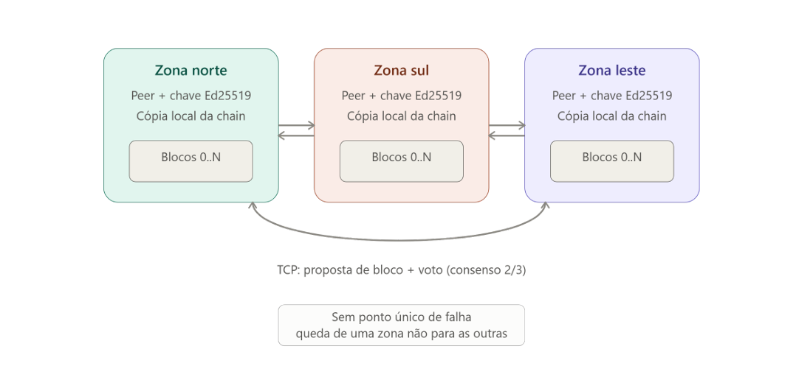
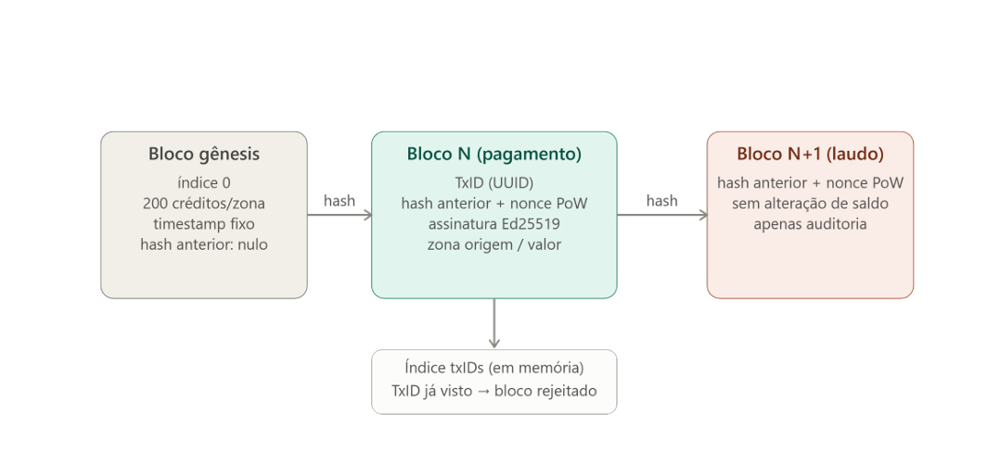
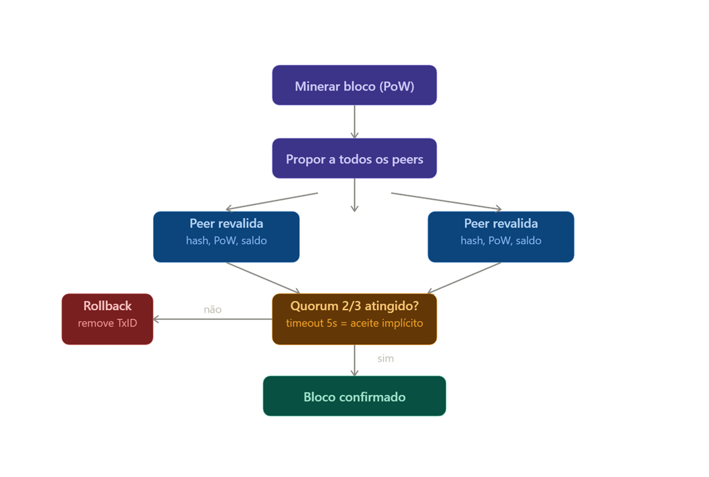
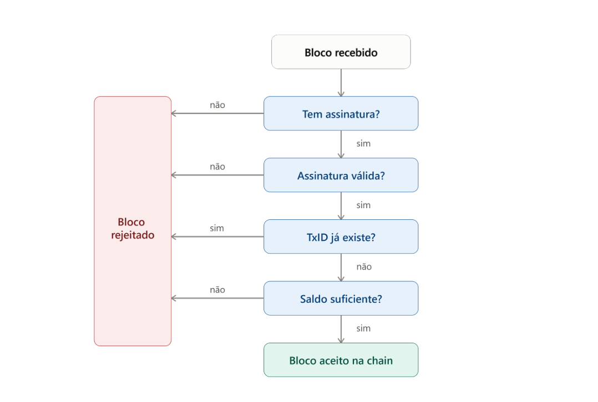

# PBL-3 — Economia e Auditoria de Guerra

Sistema distribuído P2P de coordenação de drones com blockchain própria para economia de créditos e auditoria imutável de operações. Desenvolvido como Problema 3 do MI de Concorrência e Conectividade — UEFS.

> Este projeto estende o PBL-2 (exclusão mútua com Ricart-Agrawala) com uma camada de ledger distribuído: cada zona mantém uma cópia local da chain, pagamentos são confirmados via consenso 2/3 entre peers, e todo laudo de missão é registrado de forma imutável.

---

## Sumário

- [Visão geral](#visão-geral)
- [Diferenças em relação ao PBL-2](#diferenças-em-relação-ao-pbl-2)
- [Arquitetura](#arquitetura)
- [Blockchain](#blockchain)
- [Fluxo de consenso](#fluxo-de-consenso)
- [Validação de bloco recebido](#validação-de-bloco-recebido)
- [Endpoints HTTP](#endpoints-http)
- [Execução com Docker](#execução-com-docker)
- [Variáveis de ambiente](#variáveis-de-ambiente)
- [Estrutura de pacotes](#estrutura-de-pacotes)
- [Testes manuais relevantes](#testes-manuais-relevantes)

---

## Visão geral

Três zonas (NORTE, SUL, LESTE) operam como nós independentes de uma rede P2P. Cada nó mantém:

- Uma cópia local da blockchain (`ledger.json`)
- Uma carteira de créditos derivada do histórico da chain (nunca de variável local)
- Os drones físicos registrados nessa zona

Requisitar um drone de escolta custa **10 créditos**. Cada zona começa com **200 créditos** emitidos no bloco gênesis. O pagamento só é confirmado — e o drone só é despachado — após quorum de 2/3 dos peers aceitarem o bloco via votação TCP.

---

## Diferenças em relação ao PBL-2

| Aspecto | PBL-2 | PBL-3 |
|---|---|---|
| Controle de recursos | Ricart-Agrawala (exclusão mútua) | Ricart-Agrawala **+** blockchain de pagamentos |
| Registro de operações | Sem persistência de auditoria | Laudo imutável em bloco ao fim de cada missão |
| Economia | Sem créditos | 200 créditos/zona, custo 10/requisição |
| Consenso | Quorum de REPLY (Ricart) | Ricart para alocação **+** votação 2/3 para blocos |
| Tolerância a adulteração | Não aplicável | Encadeamento SHA-256 + PoW detecta alterações |
| Auditabilidade | Nenhuma | Qualquer peer expõe `/ledger` e `/validate` |

O Ricart-Agrawala foi **mantido intacto** para garantir que dois peers não despachem o mesmo drone simultaneamente. A blockchain não substitui esse mecanismo — ela registra e valida o pagamento que já passou pela seção crítica.

---

## Arquitetura



Cada zona é um peer autônomo com:

- **Chave Ed25519** para assinar mensagens de controle
- **Cópia local da chain** persistida em `ledger.json`
- **Conexão TCP bidirecional** com os outros dois peers

A comunicação de consenso usa os mesmos canais TCP já existentes no PBL-2. Dois novos tipos de mensagem foram adicionados:

| Mensagem | Direção | Propósito |
|---|---|---|
| `BLOCO_PROPOSTA` | proponente → todos os peers | Peer minerou um bloco e pede voto |
| `VOTO_CONSENSO` | peer votante → proponente | Aceita ou rejeita o bloco candidato |
| `BLOCO` | proponente → todos os peers | Bloco confirmado para sincronização final |

Não existe nó mestre, coordenador central ou banco de dados compartilhado. Se um peer cair, os outros dois continuam operando normalmente — o peer que voltar faz sync automático via `SYNC_REQUEST`.

---

## Blockchain



### Bloco gênesis

Gerado deterministicamente por todos os peers na inicialização (timestamp fixo `2025-01-01T00:00:00Z`, ordem NORTE → SUL → LESTE). Todos os nós produzem hashes idênticos, garantindo que a chain nunca divirja desde o início.

Cada zona recebe **200 créditos** como emissão inicial.

### Tipos de transação

| Tipo | Quando é criado | Altera saldo? |
|---|---|---|
| `GENESIS` | Na inicialização, uma vez | Sim — emissão inicial |
| `PAGAMENTO` | Ao alocar drone (dentro do Ricart) | Sim — débito de 10 créditos |
| `LAUDO` | Ao receber `MISSAO_CONCLUIDA` | Não — apenas auditoria |

### Campos do bloco

```
Index          — posição na chain (0, 1, 2...)
Timestamp      — momento da mineração
Transacao      — tipo, zona, drone, créditos, ocorrência
HashAnterior   — hash do bloco anterior (encadeamento)
Hash           — SHA-256 de todos os campos acima + Nonce
Nonce          — resultado do Proof-of-Work
Minerador      — zona que minerou este bloco
```

### Proof-of-Work

Dificuldade 2 (hash deve começar com `"00"`). Em média ~256 iterações por bloco — suficiente para demonstrar o mecanismo sem impacto de latência perceptível.

### Saldo

O saldo de cada zona é **sempre recalculado percorrendo toda a chain** (`SaldoZona`). Não existe variável de saldo separada — isso garante consistência total com o histórico registrado.

---

## Fluxo de consenso



O proponente executa as seguintes etapas ao registrar um pagamento ou laudo:

1. Verifica saldo (para pagamentos)
2. Monta a transação e minera o bloco localmente (PoW)
3. Armazena um canal de votos em `PendingConsensus[hash]`
4. Propaga `BLOCO_PROPOSTA` para todos os peers via TCP
5. Conta seu próprio voto como **aceite automático**
6. Aguarda votos por até **5 segundos**
   - Se o timeout expirar sem resposta de um peer, aquele peer é contado como aceite implícito (mesmo comportamento do Ricart ao perder peer durante REQUEST)
7. Se `aceitos >= quorum (2/3)`: confirma o bloco, propaga `BLOCO` final
8. Se `aceitos < quorum`: faz rollback (`RemoverUltimoBloco`) e retorna erro

### Quorum

Com 3 zonas: `quorum = (3 × 2) / 3 = 2`. Ou seja, são necessários pelo menos 2 votos de aceite (incluindo o próprio proponente).

---

## Validação de bloco recebido



Ao receber `BLOCO_PROPOSTA`, cada peer executa em sequência:

1. **Assinatura válida?** — verifica se o bloco veio de um peer legítimo
2. **TxID já existe?** — índice em memória de hashes vistos; rejeita replay de transação
3. **Hash e PoW válidos?** — `calcularHash(bloco) == bloco.Hash` e prefixo `"00"`
4. **Encadeamento correto?** — `bloco.Index == topo+1` e `bloco.HashAnterior == topo.Hash`
5. **Saldo suficiente?** — apenas para `PAGAMENTO`; consulta a chain local

Se todas as verificações passarem, o peer aceita o bloco na sua chain local e envia `VOTO_CONSENSO{Aceito: true}`. Qualquer falha resulta em `VOTO_CONSENSO{Aceito: false, Motivo: "..."}`.

---

## Endpoints HTTP

Todos os endpoints são públicos (sem autenticação) e retornam JSON. Qualquer participante do consórcio pode auditar qualquer nó.

| Endpoint | Método | Descrição |
|---|---|---|
| `/status` | GET | Estado completo: zona, Ricart, drones, fila, peers, ledger com saldos |
| `/ledger` | GET | Arquivo `ledger.json` bruto para auditoria externa |
| `/validate` | GET | Verifica integridade da chain local (encadeamento de hashes) |

### Exemplo de resposta do `/validate`

Chain íntegra:
```json
{
  "zona": "NORTE",
  "valida": true,
  "total_blocos": 7
}
```

Chain adulterada (HTTP 409):
```json
{
  "zona": "NORTE",
  "valida": false,
  "total_blocos": 7,
  "motivo": "encadeamento de hashes quebrado — chain adulterada"
}
```

### Auditoria periódica automática

Cada peer executa uma goroutine que valida a chain a cada 30 segundos e imprime nos logs:

```
[AUDIT] ✔ Chain íntegra — 7 bloco(s) verificados
[AUDIT] ✗ ADULTERAÇÃO DETECTADA — chain local inválida!
```

---

## Execução com Docker

### Pré-requisitos

- Docker ≥ 20.10
- Docker Compose ≥ 2.0

### Subir o sistema completo

```bash
docker compose up --build
```

Isso sobe os 3 peers, 3 sensores e 3 drones. O dashboard fica disponível em `http://localhost:3000`.

### Portas expostas

| Container | Zona | TCP (P2P) | HTTP (API) |
|---|---|---|---|
| `peer1` | NORTE | `9090` | `8081` |
| `peer2` | SUL | `9091` | `8082` |
| `peer3` | LESTE | `9092` | `8083` |
| `interface` | — | — | `3000` |

### Verificar ledger de um peer

```bash
curl http://localhost:8081/status | jq '.ledger'
curl http://localhost:8082/ledger
curl http://localhost:8083/validate
```

### Rodar os testes automatizados

```bash
docker compose --profile teste up teste
```

### Derrubar um peer durante a demo

```bash
docker stop peer3   # derruba LESTE
# sistema continua operando com NORTE e SUL
docker start peer3  # reconecta; sync automático via SYNC_REQUEST
```

---

## Variáveis de ambiente

| Variável | Exemplo | Descrição |
|---|---|---|
| `ZONA` | `NORTE` | Identificador da zona (`NORTE`, `SUL` ou `LESTE`) |
| `PEARS` | `peer2:9090,peer3:9090` | Endereços TCP dos outros peers |
| `MY_ADDR` | `peer1:9090` | Endereço TCP deste peer (evita auto-conexão) |
| `HTTP_PORT` | `8080` | Porta do servidor HTTP interno |

---

## Estrutura de pacotes

```
zona/
├── server/        # main, loop TCP (conectarAosPeers), HTTP (iniciarHTTP)
│                  # Injeta ProporBlocoFn, PropagaBloco, TotalPeers no ledger
├── handler/       # ProcessarConexoes — trata conexões TCP incoming
│                  # Casos: BLOCO_PROPOSTA, VOTO_CONSENSO, BLOCO, DESPACHAR_DRONE...
├── ledger/
│   ├── block.go       # Bloco, Transacao, Minerar, PoW (dificuldade 2), calcularHash
│   ├── chain.go       # Chain, AdicionarBloco, AceitarBlocoExterno, SaldoZona,
│   │                  # ValidarChain, RemoverUltimoBloco
│   ├── ledger.go      # RegistrarPagamento, RegistrarLaudo, IniciarLedger
│   │                  # ProporBlocoFn (injetada pelo server), PropagaBloco
│   └── persistence.go # CarregarLedger, SalvarBloco (ledger.json)
├── ricart/        # Ricart-Agrawala — exclusão mútua para alocação de drone
├── repo/          # Estado local: drones, peers, fila de requisições
├── models/        # Mensagem, Drone, Requisicao, VotoConsensus, ...
└── handler/

blockchain/
├── blockchain.go  # Chain e Bloco do package blockchain (usados pelo consensus)
└── consensus.go   # ProposeAndMine, PendingConsensus, ValidarBlocoCandidato
```

O package `ledger/` é a fonte de verdade para o estado financeiro. O `blockchain/` contém a lógica de votação (`PendingConsensus`). O `server.go` conecta os dois via injeção de dependência (`ProporBlocoFn`), evitando import circular.

---

## Testes manuais relevantes

### Teste de adulteração (barema: Log Imutável)

```bash
# 1. Pare o peer3 temporariamente
docker stop peer3

# 2. Edite manualmente o ledger.json do peer3
#    Mude qualquer caractere de um campo "hash" ou "hash_anterior"
docker run --rm -v blockchain_peer3_data:/data alpine \
  sh -c 'sed -i "s/\"hash\":\"00/\"hash\":\"ff/" /data/ledger.json'

# 3. Suba o peer3 novamente
docker start peer3

# 4. Consulte /validate — deve retornar 409
curl http://localhost:8083/validate
# {"zona":"LESTE","valida":false,"total_blocos":5,"motivo":"encadeamento de hashes quebrado — chain adulterada"}

# 5. No log do peer3, em até 30s aparece:
# [AUDIT] ✗ ADULTERAÇÃO DETECTADA — chain local inválida!
```

### Teste de duplo gasto (barema: Prevenção de Duplo Gasto)

```bash
# Dispara duas requisições simultâneas da mesma zona com saldo para apenas uma
curl -X POST http://localhost:8081/requisitar -d '{"zona":"NORTE","ocorrencia":"teste"}' &
curl -X POST http://localhost:8081/requisitar -d '{"zona":"NORTE","ocorrencia":"teste"}' &
wait
# Apenas uma deve ser confirmada; a segunda retorna erro de saldo insuficiente
# Confirmar no ledger que apenas um bloco de PAGAMENTO foi adicionado
curl http://localhost:8081/status | jq '[.ledger[] | select(.transacao.tipo=="PAGAMENTO" and .transacao.zona_id=="NORTE")]'
```

### Consistência entre dois nós

```bash
# Consulta simultânea em dois peers distintos
curl http://localhost:8081/status | jq '.ledger | length'
curl http://localhost:8082/status | jq '.ledger | length'
# Devem retornar o mesmo valor após convergência
```