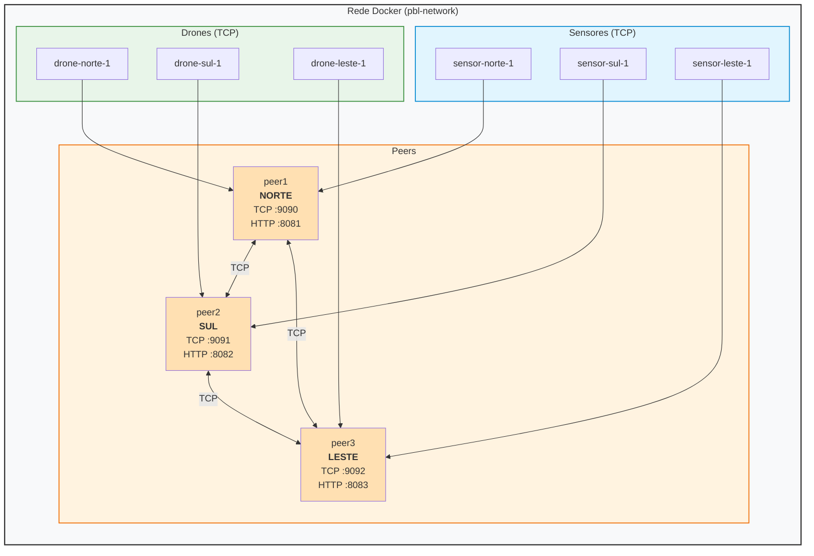

# PBL-2 — Sistema Distribuído de Coordenação de Frotas de Drones

Sistema distribuído P2P para coordenação de frotas de drones em zonas geográficas, implementado em Go. Desenvolvido como projeto do MI de Concorrência e Conectividade — UEFS.

---

## Sumário

- [Visão Geral](#visão-geral)
- [Arquitetura](#arquitetura)
- [Algoritmo de Ricart-Agrawala](#algoritmo-de-ricart-agrawala)
- [Estrutura do Projeto](#estrutura-do-projeto)
- [Pré-requisitos](#pré-requisitos)
- [Executando com Docker Compose](#executando-com-docker-compose)
- [Executando Manualmente com Docker](#executando-manualmente-com-docker)
- [Testes](#testes)
- [API HTTP](#api-http)
- [Protocolo de Mensagens TCP](#protocolo-de-mensagens-tcp)
- [Variáveis de Ambiente](#variáveis-de-ambiente)

---

## Visão Geral

O sistema simula um ambiente de monitoramento distribuído onde um ou mais sensores detectam ocorrências em três zonas geográficas (**NORTE**, **SUL**, **LESTE**) e solicitam o despacho de drones para atendimento. Cada zona é gerenciada por um servidor peer que se comunica diretamente com os demais via TCP, sem servidor central.

A coordenação do acesso exclusivo a drones compartilhados entre zonas é garantida pelo algoritmo de exclusão mútua distribuída de **Ricart-Agrawala**, com desempate por prioridade da ocorrência, timestamp físico e relógio de Lamport.

---

## Arquitetura



Cada peer mantém:

- Uma **fila de prioridade** (max-heap) de requisições pendentes de despacho de drone.
- Um **mapa de drones** replicado entre os peers via mensagens de sincronização.
- Uma instância do **algoritmo de Ricart-Agrawala** para exclusão mútua distribuída.
- Conexões TCP persistentes com todos os outros peers (full mesh).

---

## Algoritmo de Ricart-Agrawala

Quando uma zona precisa alocar um drone de outra zona (failover), ela inicia o protocolo de exclusão mútua:

1. **REQUEST** — a zona envia uma mensagem `REQUEST` a todos os peers, carregando seu relógio de Lamport, prioridade da ocorrência e timestamp físico.
2. **REPLY** — cada peer responde imediatamente se não disputa o mesmo drone ou se a requisição recebida tem prioridade maior; caso contrário, enfileira o REPLY até liberar o recurso.
3. **Seção crítica** — ao receber REPLYs de todos os peers ativos, a zona aloca o drone e executa a missão.
4. **RELEASE** — ao final da missão, a zona envia `RELEASE` a todos os peers e libera os REPLYs enfileirados.

**Critérios de desempate** (do mais para o menos prioritário):

1. Prioridade da ocorrência (maior vence)
2. Timestamp físico da requisição (menor vence)
3. Relógio de Lamport (menor vence)
4. Nome da zona (lexicográfico)

Desconexões de peers durante o protocolo são tratadas via `NotificarPeerOffline`, que concede REPLY implícito ao peer desconectado para evitar deadlock.

---

## Estrutura do Projeto

```
pbl-2/
├── zona/
│   ├── server/
│   │   ├── server.go        # Entrypoint do peer: TCP listener, HTTP server, conexão P2P
│   │   └── Dockerfile
│   ├── handler/
│   │   └── handler.go       # Processamento de mensagens TCP recebidas
│   ├── repo/
│   │   └── repo.go          # Estado global: peers, drones, fila de prioridade
│   ├── ricart/
│   │   └── ricart.go        # Implementação do algoritmo de Ricart-Agrawala
│   └── models/
│       └── models.go        # Structs compartilhadas (Drone, Requisicao, MensagemRicart, etc.)
├── drones/
│   ├── main.go              # Cliente drone: conecta ao peer, executa missões
│   └── Dockerfile
├── sensores/
│   ├── sensor.go            # Cliente sensor: gera ocorrências aleatórias com prioridade
│   └── Dockerfile
├── frontend/
│   ├── index.html           # Dashboard de monitoramento do sistema
│   ├── entrypoint.sh
│   └── Dockerfile
├── interface/
│   ├── dashbord.html        # Dashboard alternativo
│   ├── start.sh
│   └── Dockerfile
├── test/
│   ├── main.go              # Suite de testes de integração interativos
│   └── Dockerfile
├── docker-compose.yml       # Orquestração completa do sistema
├── go.mod
└── comandos.txt             # Referência de comandos docker para execução manual
```

---

## Pré-requisitos

- [Docker](https://docs.docker.com/get-docker/) >= 20.x
- [Docker Compose](https://docs.docker.com/compose/) >= 2.x
- Go >= 1.21 (apenas para rodar os testes localmente sem Docker)

---

## Executando com Docker Compose

A forma mais simples de subir todo o sistema (3 peers, 3 sensores, 3 drones, interface, teste):

```bash
# Sobe o sistema normalmente (sem o teste)
docker compose up -d

# Entra no teste interativo (em outro terminal)
docker compose run --rm teste
```

Isso sobe os seguintes serviços:

| Serviço | Zona | TCP | HTTP |
|---|---|---|---|
| peer1 | NORTE | 9090 | 8081 |
| peer2 | SUL | 9091 | 8082 |
| peer3 | LESTE | 9092 | 8083 |
| sensor-norte-1 | NORTE | — | — |
| sensor-sul-1 | SUL | — | — |
| sensor-leste-1 | LESTE | — | — |
| drone-norte-1/2/3 | NORTE | — | — |
|Interface|todas|—|3000|
|Testes|todas|—|—|

Para vizualizar a interface basta abrir o caminho http://localhost:3000 
 

Para derrubar:

```bash
docker compose down
```

---

## Executando Manualmente via Docker Hub

Para executar em máquinas separadas ou com controle individual de cada container, substitua `<IP>` pelo endereço da máquina host.

**Peers (zonas):**

```bash
# NORTE
docker run --rm \
  -e PEARS="<IP>:9092,<IP>:9091" \
  -e MY_ADDR="<IP>:9090" \
  -e ZONA="NORTE" \
  -e HTTP_PORT="8080" \
  -p 9090:9090 -p 8080:8080 \
  tonito12/zona:v1

# SUL
docker run --rm \
  -e PEARS="<IP>:9090,<IP>:9092" \
  -e MY_ADDR="<IP>:9091" \
  -e ZONA="SUL" \
  -e HTTP_PORT="8080" \
  -p 9091:9090 -p 8081:8080 \
  tonito12/zona:v1

# LESTE
docker run --rm \
  -e PEARS="<IP>:9090,<IP>:9091" \
  -e MY_ADDR="<IP>:9092" \
  -e ZONA="LESTE" \
  -e HTTP_PORT="8080" \
  -p 9092:9090 -p 8082:8080 \
  tonito12/zona:v1
```

**Drones:**

```bash
docker run -e DRONE_ID="DRONE-NORTE-01" -e SERVIDOR="<IP>:9090" tonito12/drones:v1
docker run -e DRONE_ID="DRONE-SUL-01"   -e SERVIDOR="<IP>:9091" tonito12/drones:v1
docker run -e DRONE_ID="DRONE-LESTE-01" -e SERVIDOR="<IP>:9092" tonito12/drones:v1
```

**Sensores:**

```bash
docker run \
  -e SENSOR_ID="sensor-norte-1" \
  -e ZONA="NORTE" \
  -e SERVIDOR="<IP>:9090" \
  tonito12/sensores-zona:v1
```

**Frontend (dashboard):**

```bash
docker run \
  -e PEER_NORTE="<IP>:8080" \
  -e PEER_SUL="<IP>:8081" \
  -e PEER_LESTE="<IP>:8082" \
  -p 3000:80 \
  tonito12/interface:v1
```

Acesse o dashboard em `http://localhost:3000`.

---

## Testes

A suite de testes de integração (`test/main.go`) permite validar o comportamento do sistema com múltiplos cenários de carga.


**Rodando via Docker:**

```bash
docker run -it --rm \
  -e PEER1=<IP>:9090 \
  -e PEER2=<IP>:9091 \
  -e PEER3=<IP>:9092 \
  tonito12/test-zonas:v2
```

O teste mede latência de resposta por peer, taxa de sucesso e gera um relatório com estatísticas (min/max/média/desvio padrão).

---

## API HTTP

Cada peer expõe um endpoint HTTP para consulta de status:

```
GET http://<host>:<porta>/status
```

**Exemplo de resposta:**

```json
{
  "zona": "NORTE",
  "ricart": "LIVRE",
  "drones": [
    {
      "id": "NORTE-drone-01",
      "status": "livre",
      "zona_base": "NORTE",
      "zona_atual": "NORTE"
    }
  ],
  "fila": [],
  "peers": [
    { "zona": "SUL",   "vivo": true },
    { "zona": "LESTE", "vivo": true }
  ],
  "drones_gerenciados": ["NORTE-drone-01", "NORTE-drone-02", "NORTE-drone-03"]
}
```

O campo `ricart` indica o estado atual da exclusão mútua: `LIVRE`, `QUERENDO` ou `NA_SECAO`.

---

## Protocolo de Mensagens TCP

A comunicação entre todos os nós (peers, sensores e drones) é feita via TCP com mensagens JSON delimitadas por `\n`.

A primeira mensagem enviada por qualquer cliente deve ser uma identificação:

```
IAM:SENSOR:<sensor_id>:<zona>
IAM:DRONE:<drone_id>
IAM:ZONA:<zona_id>
```

**Tipos de mensagem entre peers:**

| Tipo | Descrição |
|---|---|
| `HEARTBEAT` | Verificação de liveness |
| `REQUISICAO_DRONE` | Sensor solicita despacho de drone |
| `DESPACHAR_DRONE` | Zona instrui um drone a partir para missão |
| `REQUEST` | Ricart-Agrawala: pedido de acesso exclusivo |
| `REPLY` | Ricart-Agrawala: concessão de acesso |
| `RELEASE` | Ricart-Agrawala: liberação do recurso |
| `DRONE_UPDATE` | Atualização de estado de drone replicada entre peers |
| `SYNC_REQUEST` / `SYNC_RESPONSE` | Sincronização de estado ao conectar |
| `MISSAO_CONCLUIDA` | Drone reporta fim de missão à zona |
| `MISSAO_CONCLUIDA_ACK` | Zona de failover confirma missão à zona base |
| `GET_DRONES` / `DRONES_RESPONSE` | Consulta de drones disponíveis |

---

## Variáveis de Ambiente

### Peer (zona)

| Variável | Descrição | Exemplo |
|---|---|---|
| `ZONA` | Identificador da zona | `NORTE` |
| `MY_ADDR` | Endereço TCP próprio | `peer1:9090` |
| `PEARS` | Lista de peers separados por vírgula | `peer2:9090,peer3:9090` |
| `HTTP_PORT` | Porta do servidor HTTP de status | `8080` |

### Drone

| Variável | Descrição | Exemplo |
|---|---|---|
| `DRONE_ID` | Identificador único do drone | `NORTE-drone-01` |
| `SERVIDOR` | Endereço TCP do peer base | `peer1:9090` |

### Sensor

| Variável | Descrição | Exemplo |
|---|---|---|
| `SENSOR_ID` | Identificador único do sensor | `sensor-norte-1` |
| `ZONA` | Zona onde o sensor opera | `NORTE` |
| `SERVIDOR` | Endereço TCP do peer da zona | `peer1:9090` |

---

## Autor

<table>
  <tr>
    <td align="center" width="150px">
      <a href="https://github.com/antoniomedeiross">
        <br />
        <sub><b>Antonio Medeiros</b></sub>
      </a>
      <br>
      <br>
      <a href="https://linkedin.com/in/antoniomedeiross" title="LinkedIn">
        
      </a>
    </td>
    <td>
      <strong>Antônio Aparecido Medeiros Santana</strong><br>
      Universidade Estadual de Feira de Santana — UEFS<br>
      Departamento de Tecnologia — DTEC<br>
      antoniomedeirosdev@gmail.com
    </td>
  </tr>
</table>
---

## Segurança — Gestão de Ativos e Prevenção de Duplo Gasto (P3)

### Assinatura Digital Ed25519

Cada zona gera (ou carrega) um par de chaves **Ed25519** na inicialização (`zona/ledger/identidade.go`). Toda transação de **PAGAMENTO** é assinada com a chave privada da zona emissora antes de entrar no processo de consenso.

Os outros peers **verificam a assinatura** ao receber um `BLOCO_PROPOSTA` ou um `BLOCO` propagado. Blocos com assinatura ausente, inválida ou de chave desconhecida são **rejeitados antes mesmo do PoW ser verificado**.

A chave pública é trocada automaticamente no handshake `SYNC_REQUEST`.

### Prevenção de Duplo Gasto (TxID)

Cada transação recebe um **UUID v4 único** (`tx_id`) gerado com `crypto/rand`. A chain mantém um índice em memória de todos os TxIDs já registrados. Qualquer tentativa de inserir uma transação com TxID repetido — mesmo em nós diferentes simultaneamente — é **detectada e rejeitada** pelo validador local.

O TxID também entra no cálculo do hash do bloco, tornando impossível reutilizá-lo sem invalidar o PoW.

### Endpoints de auditoria adicionados

| Endpoint | Descrição |
|---|---|
| `GET /seguranca` | Chave pública da zona, validade da chain, peers conhecidos |
| `GET /validate` | Valida o encadeamento de hashes da chain completa |

### Testes de segurança

```bash
# Executa a suite de testes de segurança (requer sistema rodando)
docker compose --profile teste-seguranca run --rm teste-seguranca
```

Cenários cobertos:

1. **Dinheiro falso** — peer malicioso injeta bloco de PAGAMENTO com créditos inexistentes e assinatura de chave desconhecida. O sistema deve **rejeitar** o bloco nos dois pontos: via `BLOCO_PROPOSTA` (consenso) e via `BLOCO` direto (validação local).

2. **Duplo gasto** — o mesmo TxID é enviado para dois peers diferentes ao mesmo tempo. O índice de TxIDs garante que apenas **uma** ocorrência seja aceita.

3. **Adulteração de bloco** — demonstra matematicamente que alterar qualquer campo de um bloco existente muda o hash, quebrando o encadeamento com todos os blocos subsequentes.
